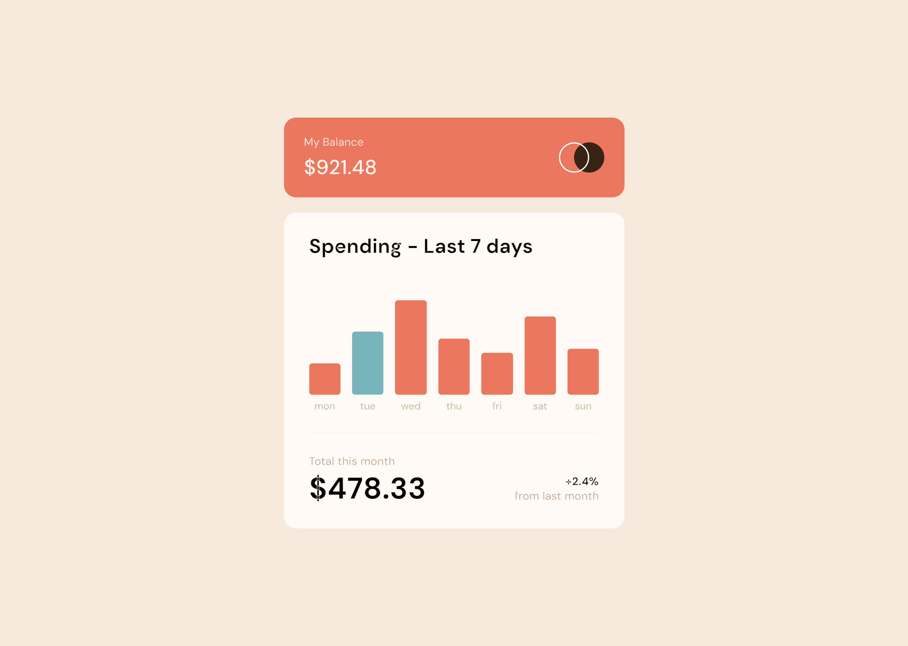

# Frontend Mentor - Expenses chart component solution

This is a solution to the [Expenses chart component challenge on Frontend Mentor](https://www.frontendmentor.io/challenges/expenses-chart-component-e7yJBUdjwt). Frontend Mentor challenges help you improve your coding skills by building realistic projects.

## Table of contents

- [The challenge](#the-challenge)
- [Screenshot](#screenshot)
- [Links](#links)
- [My process](#my-process)
- [Built with](#built-with)
- [Author](#author)

### The challenge

Users should be able to:

- View the bar chart and hover over the individual bars to see the correct amounts for each day
- See the current day’s bar highlighted in a different colour to the other bars
- View the optimal layout for the content depending on their device’s screen size
- See hover states for all interactive elements on the page
- **Bonus**: Use the JSON data file provided to dynamically size the bars on the chart

### Screenshot

This is the desktop version of the component. I didn't upload the mobile version cause it's too long.

### Links

- Live Site URL: [Live site of the challenge hosted here](https://junayedrahaman50.github.io/expenses-chart-component-main/)

## My process

I have built the layout using flexbox. I've used fetch api to fetch data from json file. Current day's bar is highlighted in different color using getDay() method. The height of the bars are dynamically calculated based on the amount given in json file.

### Built with

- Semantic HTML5 markup
- CSS custom properties
- Flexbox
- Javascript

## Author

- Website - [Junayed Rahaman](https://webpixels.netlify.app/)
- Frontend Mentor - [@junayedrahaman50](https://www.frontendmentor.io/profile/junayedrahaman50)
- Twitter - [@junayed_rahaman](https://twitter.com/junayed_rahaman)
